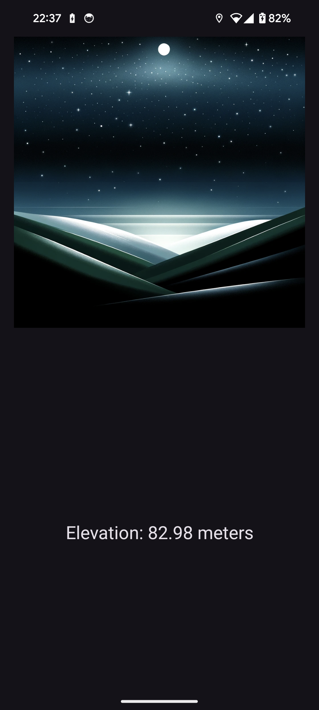

# HeightMark

Map apps make it easy to learn where you are in 2D space but I want an easy reference to see what elevation I'm at. 
This Android app is a simple way to be able to glance at current elevation.  It's also an excuse to learn about about writing Android apps.

## How it works

- Elevation comes straight from GNSS via the platform `LocationManager` — **no Google Play services dependency**, so the app works identically on certified devices and de-googled AOSP builds (GrapheneOS, LineageOS, CalyxOS, /e/OS).
- Raw GPS altitude is height above the WGS84 ellipsoid, which can differ from sea-level elevation by tens of meters. Each fix is corrected to Mean Sea Level with Android 14's offline `AltitudeConverter` (on-device geoid data, no network).
- Readings are averaged over a rolling window, with poor-vertical-accuracy fixes filtered out.
- The GPS radio duty-cycles: after ~30 s stationary it turns off, and low-power triggers (significant-motion sensor for horizontal movement, barometer for elevators and other vertical movement, passive fixes from other apps) turn it back on.
- A "Details" panel shows the nerd data: ellipsoid vs sea-level altitude, geoid offset, accuracy, satellites in view, barometric pressure, and GPS duty-cycle state.