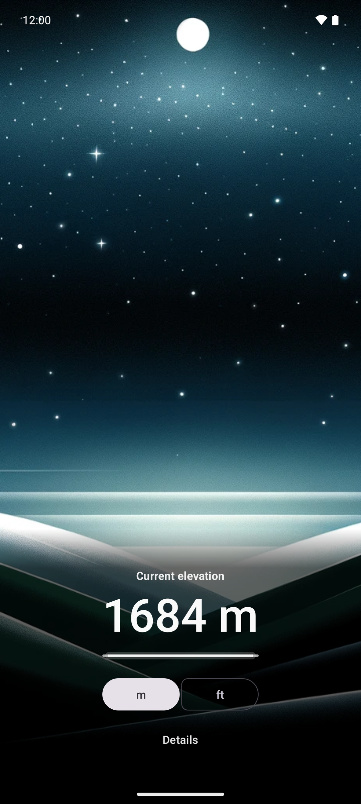

# HeightMark



Map apps make it easy to learn where you are in 2D space but I want an easy reference to see what elevation I'm at. 
This Android app is a simple way to be able to glance at current elevation.  It's also an excuse to learn about about writing Android apps.

## Install

[](https://apps.obtainium.imranr.dev/redirect?r=obtainium://add/https://github.com/arunderwood/heightmark)

Each [GitHub release](https://github.com/arunderwood/heightmark/releases) has a signed APK that can be installed by hand, or through [Obtainium](https://obtainium.imranr.dev/). Requires Android 14+.

**Verify the first install.** Android rejects updates signed by a different key, so only the first install needs checking. Paste this into [AppVerifier](https://github.com/soupslurpr/AppVerifier), or compare it with `apksigner verify --print-certs`:

```
com.bizzarosn.heightmark
21:71:C5:4B:AD:49:79:4A:3B:C3:57:A6:2B:14:9C:DB:9C:08:A8:C0:65:82:EB:CB:BA:53:90:A6:95:A3:A8:68
```

Each APK also has a build provenance attestation: `gh attestation verify heightmark-v<version>.apk -R arunderwood/heightmark`.

The Play Store build uses a different key, so switching between the two needs an uninstall.

## How it works

- Elevation comes straight from GNSS via the platform `LocationManager` — **no Google Play services dependency**, so the app works identically on certified devices and de-googled AOSP builds (GrapheneOS, LineageOS, CalyxOS, /e/OS).
- Raw GPS altitude is height above the WGS84 ellipsoid, which can differ from sea-level elevation by tens of meters. Each fix is corrected to Mean Sea Level with Android 14's offline `AltitudeConverter` (on-device geoid data, no network).
- Readings are averaged over a rolling window, with poor-vertical-accuracy fixes filtered out.
- The GPS radio duty-cycles: after ~30 s stationary it turns off, and low-power triggers (significant-motion sensor for horizontal movement, barometer for elevators and other vertical movement, passive fixes from other apps) turn it back on.
- A "Details" panel shows the nerd data: ellipsoid vs sea-level altitude, geoid offset, accuracy, satellites in view, barometric pressure, and GPS duty-cycle state.

## Privacy

Location never leaves your device. The app declares no `INTERNET` permission, so it cannot make network requests at all — there are no analytics, no ads, and no third-party services. See [PRIVACY.md](PRIVACY.md).

## License

[MIT](LICENSE)