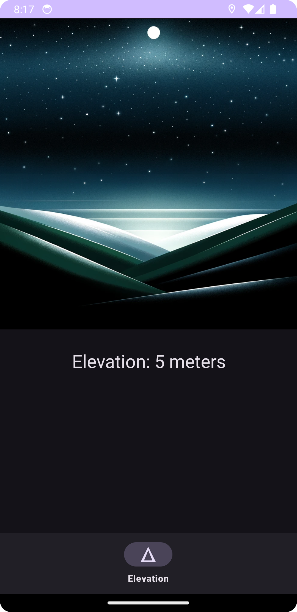

# HeightMark

Map apps make it easy to learn where you are in 2D space but I want an easy reference to see what elevation I'm at. 
This Android app is a simple way to be able to glance at current elevation.  It's also an excuse to learn about about writing Android apps.